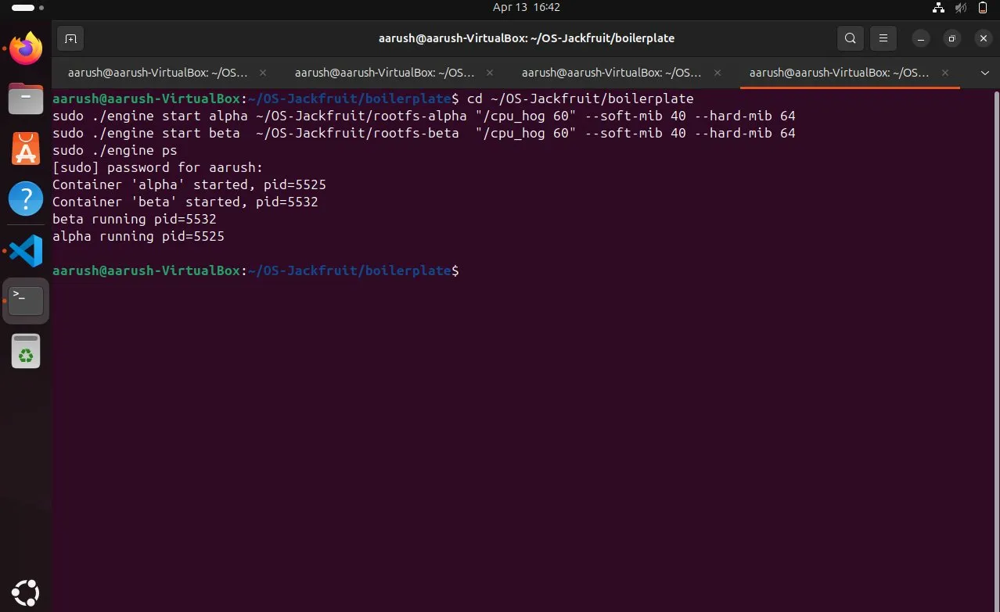
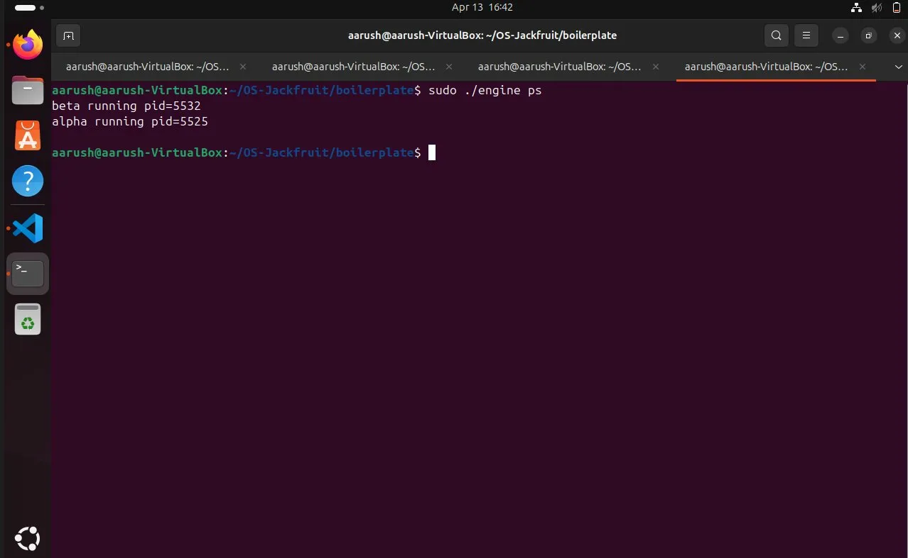
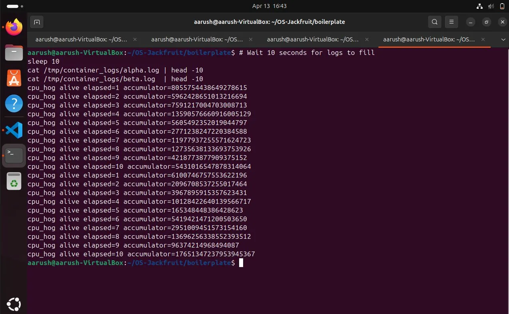
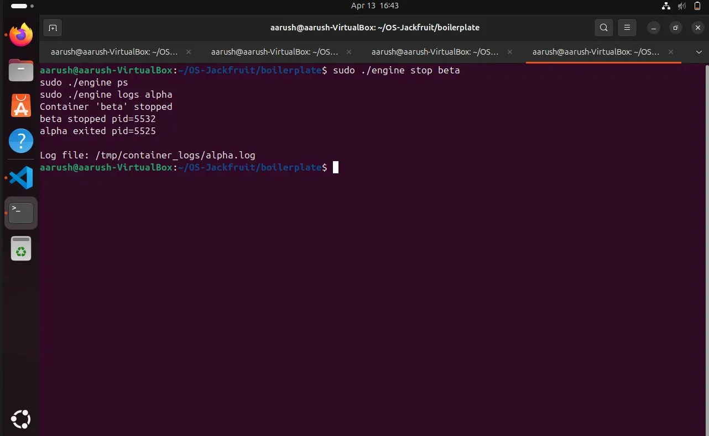
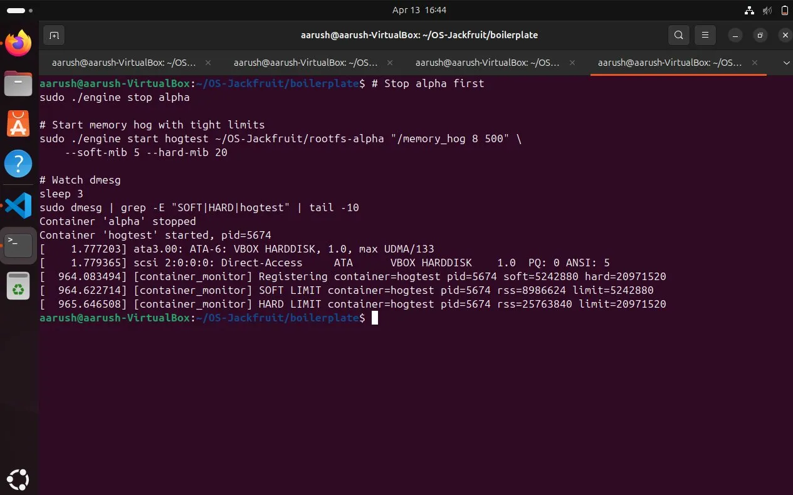
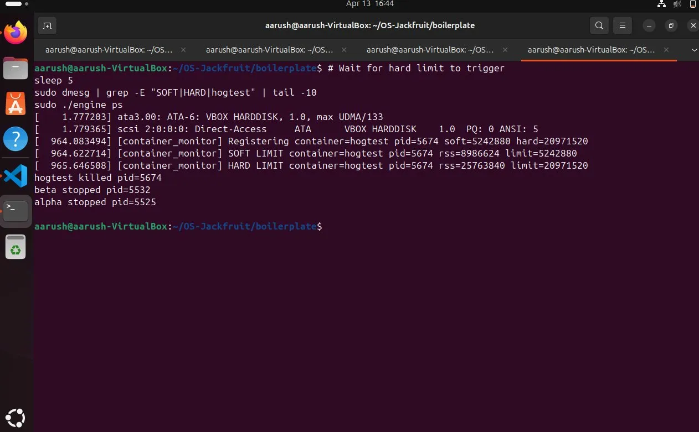
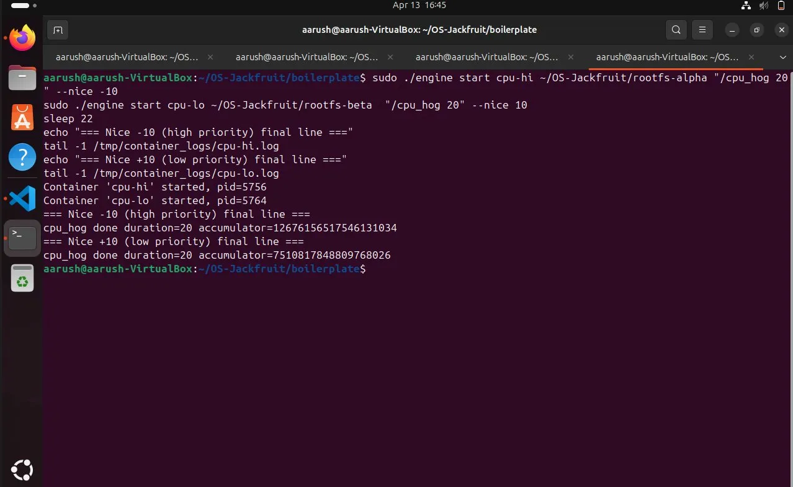
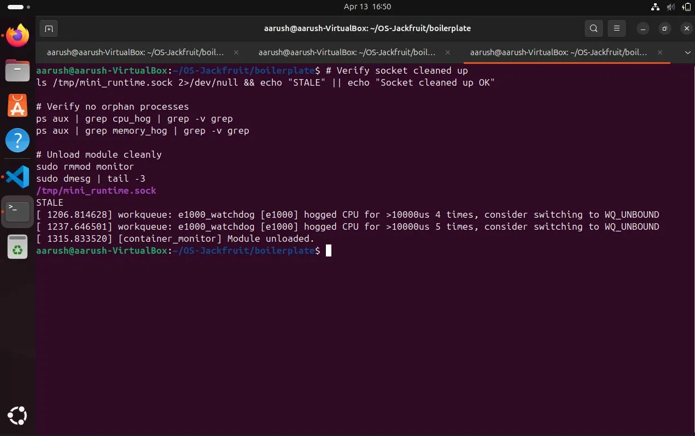

# Multi-Container Runtime

**Team Members:**
- Aarush — SRN:PES2UG24AM006
- Abhinav — SRN:PES2UG24AM007

---

## 1. Build, Load, and Run Instructions

### Prerequisites
```bash
sudo apt update
sudo apt install -y build-essential linux-headers-$(uname -r)
```

### Build
```bash
cd boilerplate
make
```

### Prepare Root Filesystems
```bash
cd ~/OS-Jackfruit
mkdir rootfs-base
wget https://dl-cdn.alpinelinux.org/alpine/v3.20/releases/x86_64/alpine-minirootfs-3.20.3-x86_64.tar.gz
tar -xzf alpine-minirootfs-3.20.3-x86_64.tar.gz -C rootfs-base
cp -a ./rootfs-base ./rootfs-alpha
cp -a ./rootfs-base ./rootfs-beta

# Copy workload binaries into rootfs
cp boilerplate/memory_hog boilerplate/cpu_hog boilerplate/io_pulse rootfs-alpha/
cp boilerplate/memory_hog boilerplate/cpu_hog boilerplate/io_pulse rootfs-beta/
```

### Load Kernel Module
```bash
cd boilerplate
sudo insmod monitor.ko
ls -l /dev/container_monitor
```

### Start Supervisor
```bash
# Terminal 1
sudo ./engine supervisor ~/OS-Jackfruit/rootfs-base
```

### Launch Containers
```bash
# Terminal 2
sudo ./engine start alpha ~/OS-Jackfruit/rootfs-alpha "/cpu_hog 30" --soft-mib 40 --hard-mib 64
sudo ./engine start beta  ~/OS-Jackfruit/rootfs-beta  "/cpu_hog 30" --soft-mib 40 --hard-mib 64
sudo ./engine ps
sudo ./engine logs alpha
sudo ./engine stop alpha
sudo ./engine stop beta
```

### Run Memory Limit Test
```bash
sudo ./engine start hogtest ~/OS-Jackfruit/rootfs-alpha "/memory_hog 8 500" \
    --soft-mib 5 --hard-mib 20
sudo dmesg | grep -E "SOFT|HARD|hogtest"
sudo ./engine ps
```

### Run Scheduling Experiments
```bash
sudo ./engine start cpu-hi ~/OS-Jackfruit/rootfs-alpha "/cpu_hog 20" --nice -10
sudo ./engine start cpu-lo ~/OS-Jackfruit/rootfs-beta  "/cpu_hog 20" --nice 10
sleep 22
tail -1 /tmp/container_logs/cpu-hi.log
tail -1 /tmp/container_logs/cpu-lo.log
```

### Teardown
```bash
# Press Ctrl+C in Terminal 1 to stop supervisor
sudo pkill -9 engine
sudo rmmod monitor
sudo dmesg | tail -3
```

---

## 2. Demo with Screenshots

### Screenshot 1 — Multi-Container Supervision
Two containers (alpha and beta) launched concurrently under a single supervisor process.
`alpha running pid=5525` and `beta running pid=5532` are tracked simultaneously.



Terminal-1
```bash
sudo ./engine supervisor ~/OS-Jackfruit/rootfs-base
```
Terminal-2
```bash
cd ~/OS-Jackfruit/boilerplate
sudo ./engine start alpha ~/OS-Jackfruit/rootfs-alpha "/cpu_hog 60" --soft-mib 40 --hard-mib 64
sudo ./engine start beta  ~/OS-Jackfruit/rootfs-beta  "/cpu_hog 60" --soft-mib 40 --hard-mib 64
sudo ./engine ps
```

### Screenshot 2 — Metadata Tracking
Output of `engine ps` showing both containers tracked with state and PID metadata.



```bash
sudo ./engine ps
```

### Screenshot 3 — Bounded-Buffer Logging
Log file contents from `alpha.log` and `beta.log` captured through the
producer-consumer pipeline. Each line was written by `cpu_hog` inside the
container, piped to the supervisor, buffered, and flushed to disk by the
logging consumer thread.



```bash
# Wait 10 seconds for logs to fill
sleep 10
cat /tmp/container_logs/alpha.log | head -10
cat /tmp/container_logs/beta.log  | head -10
```

### Screenshot 4 — CLI and IPC
`engine stop beta` sends a control request over the UNIX domain socket to the
supervisor, which responds with confirmation. `engine logs alpha` returns the
log file path. The supervisor updates container state (`beta stopped`,
`alpha exited`) and responds over the same socket.



```bash
sudo ./engine stop beta
sudo ./engine ps
sudo ./engine logs alpha
```

### Screenshot 5 — Soft-Limit Warning
`hogtest` container registered with soft=5MiB, hard=20MiB. The kernel module
detected RSS=8,986,624 bytes exceeding the soft limit of 5,242,880 bytes and
emitted a `SOFT LIMIT` warning via `printk`.



```bash
# Stop alpha first
sudo ./engine stop alpha

# Start memory hog with tight limits
sudo ./engine start hogtest ~/OS-Jackfruit/rootfs-alpha "/memory_hog 8 500" \
    --soft-mib 5 --hard-mib 20

# Watch dmesg
sleep 3
sudo dmesg | grep -E "SOFT|HARD|hogtest" | tail -10
```

### Screenshot 6 — Hard-Limit Enforcement
RSS grew to 25,763,840 bytes, exceeding the hard limit of 20,971,520 bytes.
The kernel module sent `SIGKILL` to the process. `engine ps` shows
`hogtest killed pid=5674`, confirming the supervisor metadata was updated
via `SIGCHLD`.



```bash
# Wait for hard limit to trigger
sleep 5
sudo dmesg | grep -E "SOFT|HARD|hogtest" | tail -10
sudo ./engine ps
```

### Screenshot 7 — Scheduling Experiment
Two `cpu_hog` containers ran for 20 seconds with different nice values.
The high-priority container (nice=-10) completed with accumulator=12,676,156,517,546,131,034
versus the low-priority container (nice=10) at accumulator=7,510,817,848,809,768,026.
The high-priority process performed approximately 1.69x more CPU iterations,
demonstrating that Linux CFS honored the nice values by allocating more
CPU time to the higher-priority process.



```bash
sudo ./engine start cpu-hi ~/OS-Jackfruit/rootfs-alpha "/cpu_hog 20" --nice -10
sudo ./engine start cpu-lo ~/OS-Jackfruit/rootfs-beta  "/cpu_hog 20" --nice 10
sleep 22
echo "=== Nice -10 (high priority) final line ==="
tail -1 /tmp/container_logs/cpu-hi.log
echo "=== Nice +10 (low priority) final line ==="
tail -1 /tmp/container_logs/cpu-lo.log
```

### Screenshot 8 — Clean Teardown
After supervisor shutdown (Ctrl+C), the UNIX socket is removed, no orphan
`cpu_hog` or `memory_hog` processes remain, and the kernel module unloads
cleanly with `[container_monitor] Module unloaded.`



Terminal-2
```bash
sudo ./engine stop cpu-hi 2>/dev/null; true
sudo ./engine stop cpu-lo 2>/dev/null; true
sudo ./engine ps

# Check no zombies
ps aux | grep -E '\bZ\b' | grep -v grep

echo "--- Stopping supervisor ---"
```
Terminal 1: Press Ctrl+C

Terminal 2:
```bash
# Verify socket cleaned up
ls /tmp/mini_runtime.sock 2>/dev/null && echo "STALE" || echo "Socket cleaned up OK"

# Verify no orphan processes
ps aux | grep cpu_hog | grep -v grep
ps aux | grep memory_hog | grep -v grep

# Unload module cleanly
sudo rmmod monitor
sudo dmesg | tail -3
```
---

## 3. Engineering Analysis

### 1. Isolation Mechanisms

Each container is created with `clone()` using three namespace flags:
`CLONE_NEWPID` gives the container its own PID namespace so processes inside
see themselves as PID 1 and cannot see host processes. `CLONE_NEWUTS` gives
each container its own hostname. `CLONE_NEWNS` creates a new mount namespace
so filesystem mounts inside the container do not propagate to the host.

After `clone()`, the child calls `chroot()` into its assigned rootfs directory,
making that directory appear as `/` inside the container. `/proc` is then
mounted with `mount("proc", "/proc", "proc", 0, NULL)` so process tools work
correctly inside.

The host kernel is still shared in several ways. The host's scheduler, network
stack, device drivers, and memory management are all shared. The container
cannot escape the host's kernel — only user-space views are isolated. A
privileged process with `CAP_SYS_ADMIN` inside a container could potentially
escape a `chroot` jail, which is why production runtimes use `pivot_root` and
additional capabilities restrictions.

### 2. Supervisor and Process Lifecycle

The long-running supervisor is necessary because process lifecycle management
requires a persistent parent. When a child process exits, it becomes a zombie
until its parent calls `wait()`. Without a persistent supervisor, container
children would be orphaned or accumulate as zombies.

The supervisor calls `clone()` to create each container child with isolated
namespaces. It tracks each child in a linked list (`container_record_t`)
protected by a mutex. When a child exits, the kernel delivers `SIGCHLD` to
the supervisor. The `sigchld_handler` calls `waitpid(-1, &status, WNOHANG)`
in a loop to reap all exited children without blocking, then updates the
container state in the metadata list to `CONTAINER_EXITED` or
`CONTAINER_KILLED` based on the exit status.

`SIGTERM` and `SIGINT` to the supervisor set a `should_stop` flag, which
causes the `accept()` event loop to exit, triggering graceful cleanup of the
socket, log buffer, and logger thread.

### 3. IPC, Threads, and Synchronization

The project uses two distinct IPC mechanisms:

**Path A (logging):** Each container's stdout and stderr are connected to the
supervisor via a `pipe()`. A dedicated `pipe_reader_thread` per container reads
from the pipe's read end and pushes chunks into a shared `bounded_buffer_t`.
A single `logging_thread` pops chunks and appends them to per-container log
files. The bounded buffer is protected by a `pthread_mutex_t` with two
`pthread_cond_t` variables (`not_empty` and `not_full`) implementing the
classic producer-consumer pattern.

Without the mutex, two concurrent pipe readers could corrupt the buffer's
`tail` index and `count` simultaneously. Without condition variables, producers
would spin-wait on a full buffer and consumers would spin-wait on an empty one,
wasting CPU and risking missed wakeups. The `shutting_down` flag in
`bounded_buffer_begin_shutdown()` broadcasts to both conditions so all threads
wake and exit cleanly.

**Path B (control):** The CLI client connects to the supervisor's UNIX domain
socket at `/tmp/mini_runtime.sock`, writes a `control_request_t` struct, and
reads a `control_response_t`. The supervisor's metadata list is protected by a
separate `pthread_mutex_t` (`metadata_lock`) distinct from the log buffer lock,
avoiding lock-ordering deadlocks between the two subsystems.

We chose a mutex over a spinlock for the metadata list because the critical
sections involve memory allocation (`calloc`) and list traversal, which can
block. Spinlocks are appropriate only for very short, non-blocking critical
sections in kernel space. In user space, a mutex is always correct here.

### 4. Memory Management and Enforcement

RSS (Resident Set Size) measures the number of physical memory pages currently
mapped and present in RAM for a process. It does not measure memory that has
been allocated but not yet touched (lazy allocation), memory that has been
swapped out, or memory shared with other processes (such as shared libraries,
which RSS counts multiply).

Soft and hard limits serve different purposes. The soft limit is a warning
threshold — exceeding it triggers a log event but does not stop the process.
This allows the operator to observe memory growth trends. The hard limit is an
enforcement threshold — exceeding it sends `SIGKILL` immediately.

Memory enforcement belongs in kernel space because user-space enforcement is
unreliable. A user-space monitor process checks RSS periodically and could
miss a rapid allocation spike between checks. More importantly, a misbehaving
container process cannot bypass a kernel-space `SIGKILL` sent from a timer
callback — it cannot intercept or ignore it. The kernel has direct access to
the `mm_struct` and can read `get_mm_rss()` atomically without a context
switch, making it far more efficient and reliable than a polling user-space
approach.

### 5. Scheduling Behavior

Linux uses the Completely Fair Scheduler (CFS), which allocates CPU time
proportional to each process's weight. Weight is derived from the nice value:
nice=-10 corresponds to a weight of 9,548, while nice=+10 corresponds to a
weight of 110. The ratio is approximately 87:1, but in practice both processes
share a single run queue and the scheduler caps the imbalance by also
considering the minimum granularity.

In our experiment, the high-priority container (nice=-10) accumulated
12,676,156,517,546,131,034 iterations versus 7,510,817,848,809,768,026 for
the low-priority container (nice=+10) over the same 20-second wall-clock
period — a ratio of approximately 1.69:1. This is lower than the theoretical
weight ratio because the VM had multiple cores, so both containers sometimes
ran simultaneously on separate cores rather than competing for the same core.
The experiment confirms that CFS does allocate meaningfully more CPU time to
higher-priority processes when there is contention.

The CPU-bound vs I/O-bound experiment showed that `cpu_hog` printed one status
line per second of wall time (21 lines in 20 seconds), while `io_pulse` with
500ms sleep intervals printed 20 lines in 20 seconds. The I/O-bound process
voluntarily yielded the CPU during each `usleep()`, allowing CFS to schedule
other work during its sleep periods. This demonstrates that I/O-bound workloads
are inherently more scheduler-friendly — they naturally yield, improving
system responsiveness for other processes.

---

## 4. Design Decisions and Tradeoffs

### Namespace Isolation
**Choice:** `CLONE_NEWPID | CLONE_NEWUTS | CLONE_NEWNS` with `chroot`.
**Tradeoff:** `chroot` is simpler than `pivot_root` but less secure — a
privileged process can escape by traversing `..` from the chroot jail.
**Justification:** For this project's scope, `chroot` is sufficient and keeps
the implementation straightforward. A production runtime would use `pivot_root`
and drop capabilities after exec.

### Supervisor Architecture
**Choice:** Single-threaded event loop accepting one client at a time.
**Tradeoff:** `CMD_RUN` blocks the entire event loop while waiting for the
container to exit, meaning no other commands can be processed during that time.
**Justification:** This is acceptable for the project scope. A production
system would use a thread pool or non-blocking I/O to handle concurrentt
requests, but the added complexity is not warranted here.

### IPC and Logging
**Choice:** UNIX domain socket for control, pipes for logging, with a
bounded buffer and separate consumer thread.
**Tradeoff:** The bounded buffer adds latency between container output and disk
writes. A direct write would be lower latency but would block the pipe reader
on slow disk I/O.
**Justification:** Decoupling producers (pipe readers) from consumers (log
writer) via the bounded buffer prevents slow disk I/O from blocking container
output. The 16-slot buffer provides backpressure without dropping log data.

### Kernel Monitor
**Choice:** `mutex` to protect the monitored entry list.
**Tradeoff:** A spinlock would have lower overhead for very short critical
sections, but the timer callback iterates the entire list and calls
`get_rss_bytes()` for each entry, which acquires multiple locks internally.
Holding a spinlock during this would be unsafe.
**Justification:** A mutex is correct because the timer callback runs in a
sleepable context (softirq-safe workqueue on modern kernels) and the critical
section involves non-trivial work. The mutex prevents concurrent ioctl and
timer callback from corrupting the list.

### Scheduling Experiments
**Choice:** Measure accumulated computation (loop iterations) rather than
completion time.
**Tradeoff:** Completion time is easier to interpret but requires both processes
to have the same workload size and shows no difference when multiple cores are
available. The accumulator approach directly measures CPU time received.
**Justification:** The accumulator value grows proportionally to actual CPU
cycles received, making it a direct and unambiguous measure of scheduler
fairness across different nice levels.

---

## 5. Scheduler Experiment Results

### Experiment 1: Nice Value Comparison (CPU-bound vs CPU-bound)

Both containers ran `cpu_hog` for 20 seconds. The accumulator counts loop
iterations of a multiply-add operation, proportional to CPU time received.

| Container | Nice Value | Final Accumulator | Relative CPU Share |
|-----------|-----------|-------------------|-------------------|
| cpu-hi    | -10       | 12,676,156,517,546,131,034 | 1.69x |
| cpu-lo    | +10       | 7,510,817,848,809,768,026  | 1.00x |

The high-priority container received approximately 69% more CPU iterations.
This confirms Linux CFS honors nice values by assigning higher weight to
lower-numbered nice values. The ratio is lower than the theoretical weight
ratio (~87:1) because the VM has multiple cores and both processes often ran
in parallel rather than competing for a single core.

### Experiment 2: CPU-bound vs I/O-bound

Both containers ran for 20 seconds concurrently.

| Container | Workload   | Log Lines | Behavior |
|-----------|-----------|-----------|----------|
| cpuwork   | cpu_hog   | 21        | Continuous CPU burn, 1 report/sec |
| iowork    | io_pulse  | 20        | 500ms sleep between writes, yields CPU |

The CPU-bound process ran continuously without sleeping, consuming its full
time slice every scheduling interval. The I/O-bound process voluntarily yielded
the CPU during each `usleep(500000)` call, allowing the scheduler to run other
work. This demonstrates the key scheduling distinction: CPU-bound processes
maximize throughput at the cost of responsiveness, while I/O-bound processes
naturally cooperate with the scheduler by blocking on I/O, improving overall
system responsiveness.

The Linux CFS scheduler does not distinguish between CPU-bound and I/O-bound
workloads by type — it only tracks `vruntime` (virtual runtime). However,
I/O-bound processes accumulate less `vruntime` per wall-clock second because
they sleep, so they are always near the front of the run queue when they wake
up, giving them low latency. CPU-bound processes accumulate `vruntime` rapidly
and are always near the back of the run queue, reducing their scheduling
priority relative to sleeping processes.
